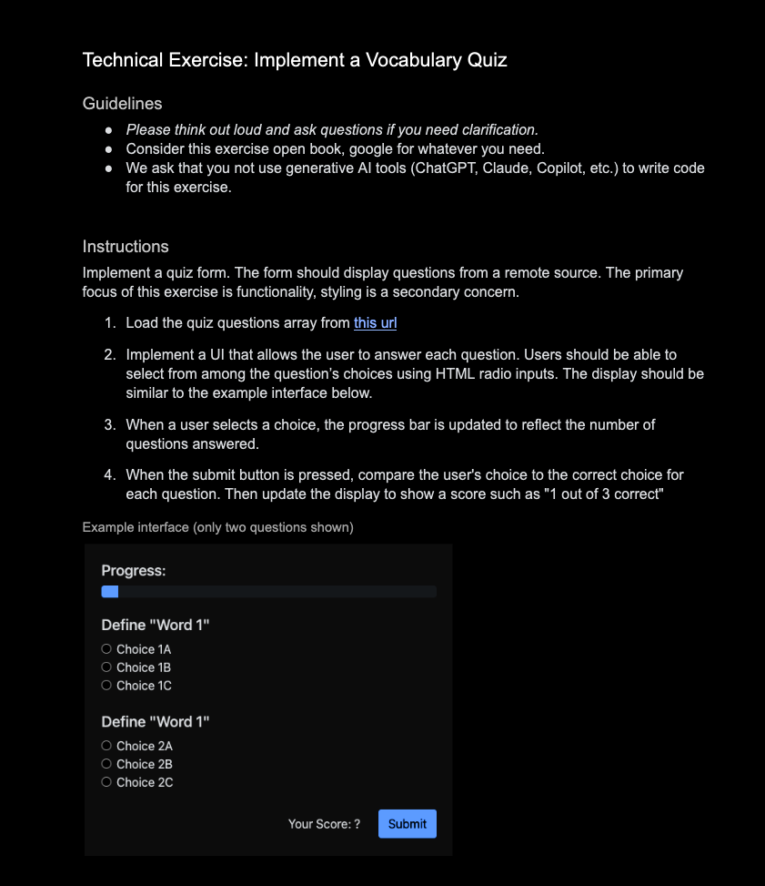

# Quiz form

## Instructions

1. Implement a quiz form. The form should display questions from a remote source. The primary focus of this exercise is
   functionality, styling is a secondary concern
2. Load the quiz questions array from this url
3. Implement a UI that allows the user to answer each question. Users should be able to select from among the question’s
   choices using HTML radio inputs. The display should be similar to the example interface below
4. When a user selects a choice, the progress bar is updated to reflect the number of questions answered
5. When the submit button is pressed, compare the user's choice to the correct choice for each question. Then update the
   display to show a score such as "1 out of 3 correct"
6.

- Note - although the endpoint is remote, I have moved it to `api.json` as that endpoint was created by the interviewer.
  Treat it like an endpoint with error handling and loading states

